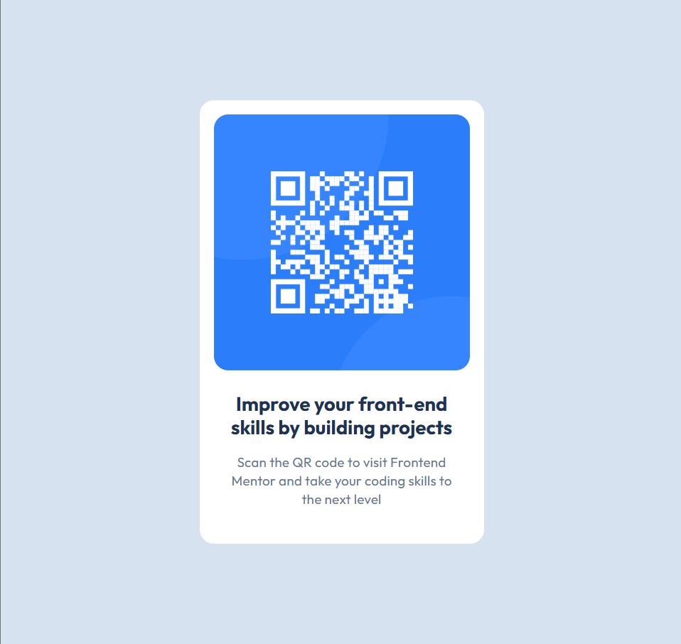

# Frontend Mentor - QR code component solution

This is a solution to the [QR code component challenge on Frontend Mentor](https://www.frontendmentor.io/challenges/qr-code-component-iux_sIO_H).  
Frontend Mentor challenges help you improve your coding skills by building realistic projects.

---

## Table of contents

- [Overview](#overview)
  - [Screenshot](#screenshot)
  - [Links](#links)
- [My process](#my-process)
  - [Built with](#built-with)
  - [What I learned](#what-i-learned)
  - [Continued development](#continued-development)
  - [Useful resources](#useful-resources)
- [Author](#author)

---

## Overview

### Screenshot

---

### Links

- **Solution URL:** [https://github.com/Amishka-Sayyid/QR-code-component](#)

- **Live Site URL:** [Add live site URL here](#)

---

## My process

### Built with

- Semantic **HTML5** markup
- **CSS** custom properties
- **Flexbox**

---

### What I learned

While building this project, I learned how to:

- Center elements with **Flexbox**
- Use **CSS variables**
- Create a **responsive card layout**
- Brush up on my existing HTML and CSS skills

---

### Continued development

In future projects, I want to explore and practice **CSS Grid** to improve my layout techniques and build more complex responsive designs.

---

### Useful resources

- None used for this project — I relied on prior knowledge and practice with HTML and CSS.

---

## Author

- **Name:** Amina Ibrahim
- **Frontend Mentor:** [@Amishka-Sayyid](https://www.frontendmentor.io/profile/Amishka-Sayyid)
- **Portfolio:** [amina-ibrahim.onrender.com](https://amina-ibrahim.onrender.com)
